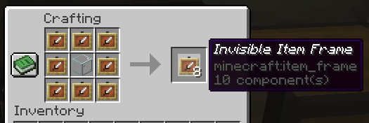

# ZInvisItemFrames

A lightweight Minecraft plugin that allows players to craft and use invisible item frames.

## Features

- Craft invisible item frames
- Customizable crafting recipe. (Can choose ANY ITEM for the recipe)
- Empty invisible frames can have a glowing outline (configurable)
- MiniMessage support for all text formatting

## Compatibility

- Paper 1.20.1 -> 1.21.4
- Folia-compatible
- Java 17+

## Dependencies

- [MCKotlin](https://modrinth.com/plugin/mckotlin)

## Crafting Recipe

The default crafting recipe is 8 item_frame (or glow_item_frame) in a circle with one custom item in the middle.
You can change the middle-item with `/ziif item`.
You can also configure how many invisible item frames are crafted from the recipe.



## Commands

- `/ziif help` - Show help information
- `/ziif item` - Set the recipe item to the item in your hand
- `/ziif reload` - Reload the configuration
- `/ziif give <player> <amount> [--glow]` - Give invisible item frames to a player

## Permissions

- `zinvisitemframes.craft.item_frame` - Allow crafting invisible item frames
- `zinvisitemframes.craft.glow_item_frame` - Allow crafting invisible glow item frames
- `zinvisitemframes.admin` - Access to all plugin commands

## Installation

1. Download the latest version of ZInvisItemFrames from [Modrinth](https://modrinth.com/plugin/zInvisItemFrames/versions).
2. Download the appropriate version of MCKotlin from [Modrinth](https://modrinth.com/plugin/mckotlin)
3. Place the downloaded `.jar` files into your server's `plugins/` folder.
4. Restart your server.
5. Configure the plugin to your liking by editing the `.yml` files in the `plugins/ZInvisItemFrames/` folder.

## Configuration

```yaml
recipe:
  item: []  # Set with `/ziif item` command
  quantity: 8  # How many frames are crafted per recipe
  check-permission: false  # Whether to check permissions for crafting

empty-frame:
  glow: true  # Whether empty frames should glow

name:
  invis-item_frame: "<italic>Invisible Item Frame"
  invis-glow_item_frame: "<italic>Invisible Glow Item Frame"
```

